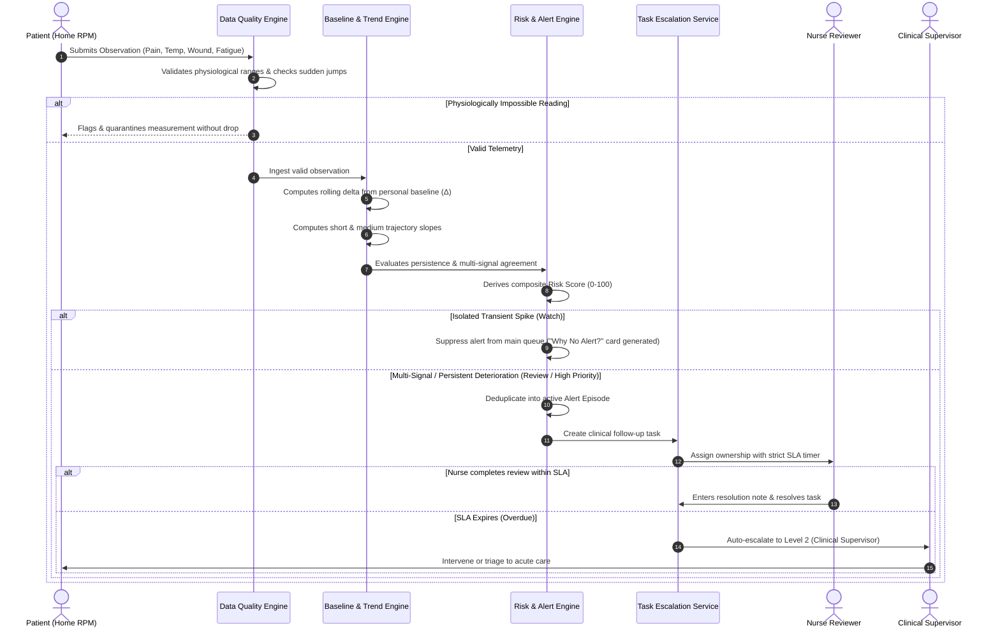

# RecoverAI: Clinical Operations & User Workflow

## 1. End-to-End Operational Workflow

---

## 2. Care Team Personas & Responsibilities

| Role | Synthetic Owner Name | Primary Dashboard Views | SLA Responsibilities |
| :--- | :--- | :--- | :--- |
| **Care Coordinator** | Coordinator Alex | Overview, Priority Queue | Monitors early recovery patients, reviews Watch/Review items within 6 hours |
| **Nurse Reviewer** | Nurse Sarah | Priority Queue, Patient Timeline | Investigates High Priority alerts, reviews "What Changed?" summary within 2 hours |
| **Clinical Supervisor** | Dr. Miller | Tasks & Escalation Queue | Receives Level 2 auto-escalated overdue tasks, directs clinical interventions |
| **Escalation Manager** | Operations Queue | System Health, Audit Trail | Manages Level 3 system bottlenecks and care pathway exceptions |
